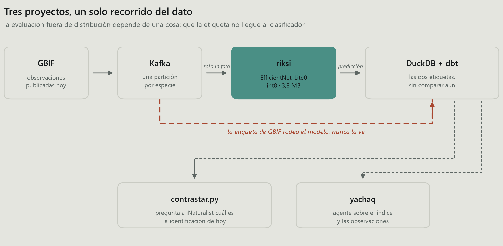
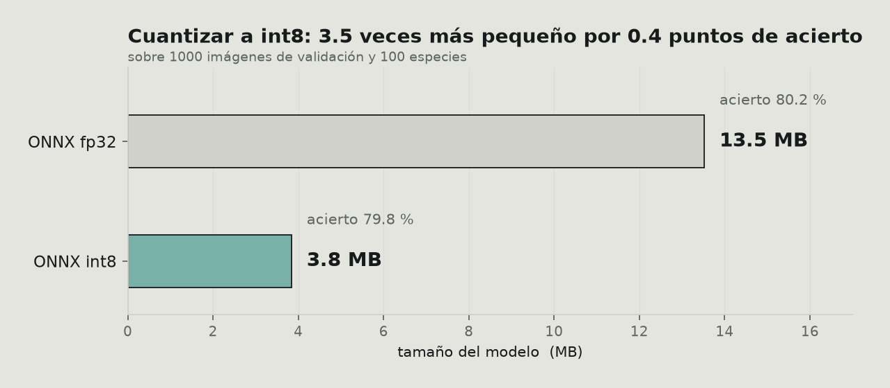
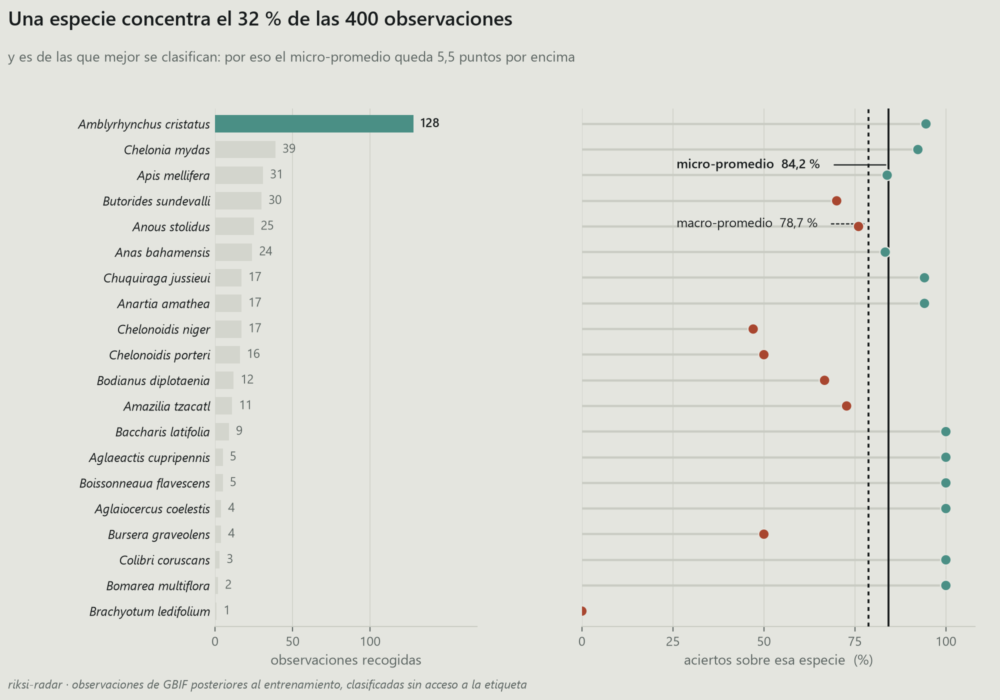
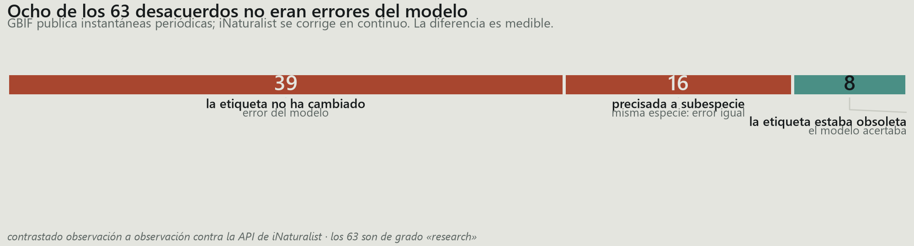
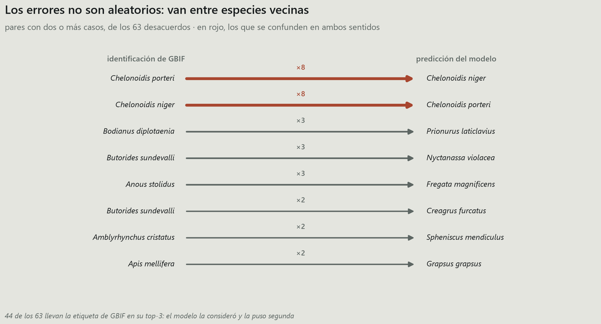
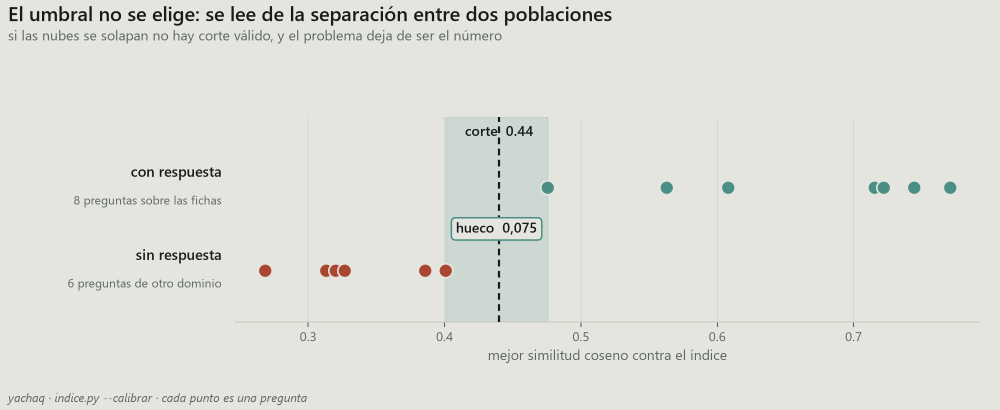
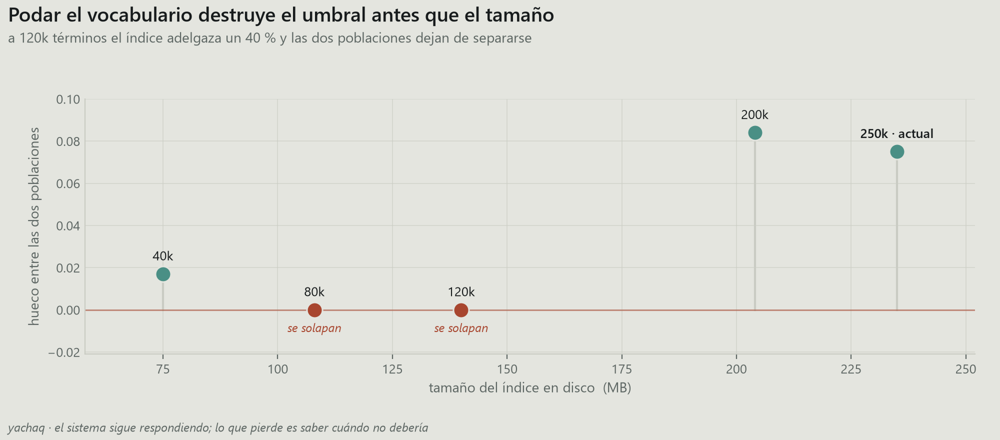
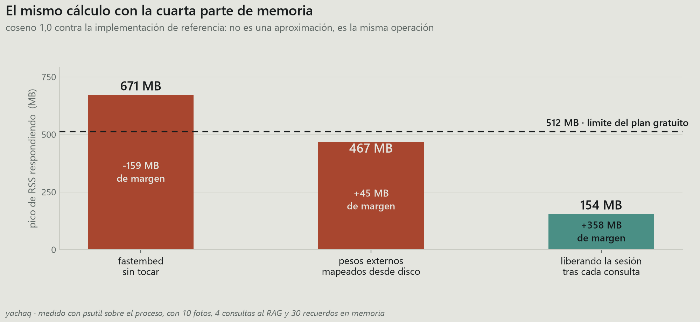

Entrené un clasificador de cien especies ecuatorianas, monté un pipeline para
evaluarlo sobre observaciones que nadie había seleccionado y construí un agente
sobre ambos. Tres repositorios, unos tres meses.

Lo que sigue no es cómo los construí. Es el patrón que encontré al revisarlos:
**cada vez que sustituí una estimación cómoda por una medición correcta, el
número empeoró.** Cuatro veces. En las cuatro, la cifra original era defendible,
estaba publicada, y describía algo distinto de lo que yo creía.

La asimetría tiene una explicación mecánica. Una métrica que sale mal te empuja a
revisar el cálculo; una que sale bien se publica. El resultado es que el error
solo sobrevive en una dirección, y no en la inocua.

---

## El montaje

Lo mínimo para seguir el resto:

| | |
|---|---|
| **[riksi](https://github.com/DiegoFernandoLojanTenesaca/riski)** | EfficientNet-Lite0, cien clases, 3,8 MB en int8. Inferencia en el navegador sobre ONNX Runtime Web |
| **[riksi-radar](https://github.com/DiegoFernandoLojanTenesaca/riksi-radar)** | Kafka → clasificador → DuckDB → dbt. Consume observaciones de [GBIF](https://www.gbif.org/) y las clasifica sin acceso a la etiqueta |
| **[yachaq](https://github.com/DiegoFernandoLojanTenesaca/yachaq)** | Agente sobre ambos: recuperación, memoria persistente, servidor MCP |



El detalle que hace válido el montaje está en la línea roja: la etiqueta de GBIF
viaja en paralelo y no entra al clasificador. Se almacenan las dos, se comparan
después. Sin esa separación no hay evaluación, hay una consulta.

El modelo obtiene **79,8 %** de exactitud top-1 sobre 1000 imágenes de
validación. Esa cifra está bien medida y no es ninguna de las cuatro que se
caen.

Conviene fijar antes el coste de la cuantización, porque es la única decisión del
proyecto que salió gratis:



Cuatro décimas de exactitud por un factor 3,5 en tamaño. Para un modelo que se
descarga en el navegador de alguien con datos móviles, la decisión no admite
discusión.

---

## Uno · Exactitud fuera de distribución, mal promediada

El conjunto de validación comparte distribución generadora con el de
entrenamiento: mismas fuentes, mismos fotógrafos, mismo sesgo de encuadre. Un
79,8 % en esas condiciones acota poco sobre el comportamiento real.

Para medir fuera de esa distribución construí el radar: consume observaciones
publicadas en GBIF **con posterioridad** al entrenamiento, subidas por gente
distinta, sin selección previa, y las clasifica sin acceso a la etiqueta.

Sobre 400 observaciones: 337 aciertos. **84,2 %.**

Seis puntos por encima del banco de validación. Publiqué ese número con la
palabra «sube» en negrita.

La aritmética es correcta. La interpretación no.



El panel izquierdo contiene el problema: *Amblyrhynchus cristatus*, la iguana
marina, aporta 128 de las 400 observaciones. Las tres clases más frecuentes
suman la mitad del conjunto, y de las cien clases del modelo solo aparecen
veinte.

La ciencia ciudadana no muestrea uniformemente. La gente fotografía lo que ve, y
en Galápagos ve iguanas marinas. Ese 84,2 % es, en buena parte, el rendimiento
del modelo sobre una clase, repetido 128 veces.

El panel derecho explica la dirección del sesgo: la iguana marina está entre las
clases que **mejor** resuelve (94,5 %). La distribución de evaluación está
dominada por un caso fácil, así que el micro-promedio se infla en lugar de
hundirse.

Con macro-promedio —cada clase pesa igual, independientemente de su frecuencia:

| | exactitud |
|---|---|
| micro-promedio (por observación) | 84,2 % |
| **macro-promedio (por clase)** | **78,7 %** |

Son dos consultas que difieren en un `group by`:

```sql
-- micro: cada observación pesa lo mismo
select avg(coincide::int) from observaciones;

-- macro: cada clase pesa lo mismo
select avg(tasa) from (
  select especie, avg(coincide::int) as tasa
  from observaciones group by especie
);
```

Y aquí está el resultado que importa: **78,7 % fuera de distribución contra
78,0 % en el banco de validación.** El modelo no mejora al salir de su reparto.
Se comporta igual.

Es una conclusión considerablemente más aburrida y bastante más creíble.
«Ausencia de deriva detectable» es un hallazgo. «Mejora en producción» era un
artefacto del estimador que elegí.

> Sobre datos de ciencia ciudadana, publica el macro-promedio. El micro-promedio
> describe la distribución marginal de tus clases tanto como el rendimiento de tu
> modelo, y no distingue una cosa de la otra.

La diferencia de 5,5 puntos no es un tecnicismo: es la magnitud del sesgo de
muestreo, expresada en las unidades de la métrica.

### Por qué el pipeline lleva Kafka

Objeción razonable: 400 observaciones caben en un CSV.

El caudal real no es 400. GBIF recibe del orden de **130.000 observaciones
diarias solo de Ecuador**; el 1,6 % cae en las cien clases del modelo, unas 6.000
al día. Las 400 son una ventana para medir, no el flujo.

Dicho eso, lo que aprendí montándolo fue otra cosa. **El broker no arrancaba**, y
el mensaje señalaba al sitio equivocado:

```
advertised.listeners cannot use the nonroutable meta-address 0.0.0.0
```

Yo ya había sobrescrito `advertised.listeners`. Tardé cuatro intentos en ver que
la queja no era sobre ese, sino sobre el listener del **controlador**, también en
`0.0.0.0`, del que Kafka deriva su dirección anunciada cuando no se declara una:

```properties
# el determinante es el segundo, no el primero
listeners=PLAINTEXT://0.0.0.0:9092,CONTROLLER://localhost:9093
advertised.listeners=PLAINTEXT://localhost:9092
```

El segundo fallo fue más silencioso. **El broker daba el consumidor por muerto.**
Por omisión entrega 500 registros por `poll()` y espera el siguiente en cinco
minutos. Descargar y clasificar 500 fotos excede ese plazo con holgura, así que
el grupo se reequilibraba y el `commit` fallaba con *«the group has already
rebalanced»*, descartando trabajo ya hecho.

```python
consumidor = KafkaConsumer(
    TEMA,
    max_poll_records=20,        # lotes que caben en el intervalo
    max_poll_interval_ms=900_000,
    enable_auto_commit=False,   # confirmar al terminar el lote, no antes
)
```

`enable_auto_commit=False` es la parte que importa. Con confirmación automática,
Kafka marca como procesado lo que todavía estás descargando; si el proceso muere
a mitad de lote, esas observaciones no vuelven a entregarse nunca.

Es el patrón general de meter trabajo lento dentro del bucle de un consumidor: no
se manifiesta en pruebas cortas y aparece con volumen.

---

## Dos · Desacuerdos que no eran del modelo

Quedaban 63 observaciones donde el clasificador y GBIF discrepaban. Tres
explicaciones posibles: error del modelo, observación mal identificada, o la
imagen no muestra lo que declara el registro.

Escribí en el README que el pipeline no resuelve cuál de las tres aplica, y que
las tortugas de Galápagos que aparecían repetidamente correspondían a «taxonomía
en disputa entre biólogos».

Eso último me lo inventé. Sonaba plausible, encajaba, y no lo verifiqué.

Existe una cuarta explicación, y es comprobable: **GBIF publica instantáneas
periódicas, no un espejo en tiempo real de iNaturalist.** Una observación
corregida en origen puede seguir en GBIF con la identificación anterior.

La verificación son dos saltos. GBIF conserva el identificador de iNaturalist en
`catalogNumber`, lo que permite consultar la identificación **vigente**:

```python
def _en_inaturalist(clave_gbif):
    oc = _pedir(f"{GBIF}/occurrence/{clave_gbif}")
    id_inat = oc.get("catalogNumber")          # el enlace al origen
    d = _pedir(f"{INAT}/observations/{id_inat}")
    o = d["results"][0]
    return {"taxon_hoy": (o.get("taxon") or {}).get("name"),
            "grado": o.get("quality_grade"),
            "identificaciones": o.get("identifications_count", 0)}
```

El parámetro `photo_id` de la API de iNaturalist parecía la vía directa. No
filtra: devuelve los 382 millones de resultados. Se ignora sin error.

Los 63, dos minutos de peticiones. Veinticuatro tienen hoy otra etiqueta.

Aquí es donde el análisis se podía haber roto, porque no todos los cambios
significan lo mismo:

| cambio | interpretación |
|---|---|
| `Anous stolidus` → `Anous stolidus galapagensis` | **refinamiento**: se precisó la población; la especie no cambia y el modelo sigue equivocado |
| `Chelonoidis porteri` → `Chelonoidis niger porteri` | **reasignación**: el taxón pasa a depender de *C. niger* |

En el segundo caso el modelo había predicho `Chelonoidis niger`. Bajo la
taxonomía vigente, **la predicción es correcta**. La tortuga de Santa Cruz pasó a
considerarse subespecie de *C. niger*, y GBIF conservaba la clasificación
anterior.

Contar juntos los dos tipos de cambio habría convertido un hallazgo en un
autoengaño. Por eso la lógica que clasifica cada caso es la única pieza con
pruebas propias:

```python
def _juzgar(caso, hoy):
    gbif, dice, ahora = caso["gbif"], caso["modelo"], hoy["taxon_hoy"]
    if ahora == gbif:                           return "sigue igual"
    if _es_hijo(ahora, gbif):                   return "precisada"
    if ahora == dice or _es_hijo(ahora, dice):  return "el modelo tenía razón"
    return "cambió de especie"
```

`_es_hijo` compara por componentes del nombre, no con `startswith`, que aceptaría
una coincidencia a media palabra:

```python
def _es_hijo(taxon, especie):
    partes, base = (taxon or "").split(), (especie or "").split()
    return len(partes) > len(base) and partes[:len(base)] == base

assert not _es_hijo("Anous stolidusa", "Anous stolidus")
assert not _es_hijo("Anous stolidus", "Anous stolidus")   # ni hija de sí misma
assert     _es_hijo("Chelonoidis niger porteri", "Chelonoidis niger")
```

El resultado:



Ocho de 63 no eran errores. Los 63 son de grado *research* en iNaturalist —
identificaciones que la comunidad ya validó—, de modo que los 55 restantes no
admiten atenuantes.

**Y aun así conviene rebajar el hallazgo.** Los ocho pertenecen al mismo taxón.
Descontarlos eleva el macro-promedio de 78,7 % a 81,2 %, pero eso corrige una
clase de veinte y ninguna otra: es el sesgo del caso anterior reapareciendo por
otra vía. La cifra que seguiría publicando es 78,7 %.

Lo que sí deja es un dato reutilizable: **el 13 % de los registros que verifiqué
tenían la etiqueta desactualizada en GBIF.** Quien entrene con datos de GBIF sin
contrastar el origen está heredando ese desfase sin saberlo.

### Los errores tienen estructura

Un recuento agregado de errores dice cuántos hay. Los pares dicen cuáles, que es
lo accionable:



Las dos tortugas se confunden **en ambas direcciones**, ocho veces en cada una.
Eso no es error disperso: es un par de clases que el modelo no separa. El
diagnóstico y la corrección son distintos —más ejemplos de ese par, o fusionar
las clases— de los que aplicarían a errores independientes.

El resto son pares que comparten hábitat: la iguana marina contra el pingüino de
Galápagos, la abeja europea contra el cangrejo rojo. Podría explicar por qué —
misma roca, misma postura— pero sería exactamente la clase de racionalización que
me costó el caso anterior, así que me limito a dejar constancia del patrón.

Y 44 de los 63 llevan la etiqueta de GBIF en su top-3: el modelo la consideró y
la puso segunda. La distancia entre el 78,7 % y un sistema utilizable es más
corta de lo que sugiere el número, si la interfaz ofrece tres candidatos en vez
de uno.

---

## Tres · Un umbral fijado sin medir

El agente recupera sobre fichas de las cien especies. La pregunta habitual: a
partir de qué similitud una ficha recuperada es relevante.

Puse 0,5. Número redondo, sin justificación.

Lo que hay que medir no es la similitud media, sino **si las dos poblaciones se
separan**: preguntas que el corpus puede responder frente a preguntas que no. Si
las distribuciones se solapan, ningún umbral funciona, y el problema deja de ser
el número.



Se separan, con un hueco de 0,075 entre la peor pregunta respondible y la mejor
no respondible. El punto medio cae en **0,44**.

```python
buenas = sorted(mejor(p) for p in con_respuesta)                 # peor primero
malas = sorted((mejor(p) for p in sin_respuesta), reverse=True)  # mejor primero
corte = round((buenas[0] + malas[0]) / 2, 2)

if buenas[0] <= malas[0]:
    print("SE SOLAPAN: ningún corte las separa.")
```

Las preguntas no respondibles son deliberadamente ajenas al dominio —«¿cuándo se
estrenó Blade Runner?», «receta de arroz con leche»—. Si el índice no las
rechaza, no rechaza nada, y el umbral es decorativo.

El hallazgo colateral vino de intentar reducir el índice, que ocupaba 235 MB, de
los cuales 192 eran la tabla de vocabulario: 250.000 tokens para unos cincuenta
idiomas, de los que este proyecto usa 8.403. Parecía peso muerto.



A 120.000 términos el índice adelgaza un 40 % y **el umbral deja de existir**: no
queda separación que partir. Sin medir el hueco, ese recorte parece gratuito. El
sistema sigue respondiendo; lo que pierde es la capacidad de no responder, que es
lo único que impide a un sistema de recuperación fabricar contexto.

Los identificadores intermedios no eran relleno de otros idiomas: son las
subpalabras que sostienen el español. Eliminarlos degrada las preguntas
respondibles más que las otras, que es exactamente la dirección equivocada.

---

## Cuatro · 671 MB en un contenedor de 512

Este caso no es de medición, pero es el que más enseñó.

El agente tenía que caber en una capa gratuita: 512 MB. Con `fastembed`, el
proceso alcanzaba **671 MB** solo cargando el codificador.



Reescribí la inferencia sobre ONNX Runtime. Dos cambios la resolvieron. El
primero, almacenar los pesos como datos externos, lo que hace que onnxruntime los
mapee desde disco en vez de copiarlos a memoria:

```python
onnx.save(modelo, str(LIGERO / "modelo.onnx"), save_as_external_data=True, ...)

opciones = ort.SessionOptions()
opciones.enable_cpu_mem_arena = False      # sin arena que crece y no devuelve
ort.InferenceSession(ruta, sess_options=opciones)
```

Eso deja el proceso en 457 MB en reposo. Pero el pico respondiendo alcanza
**467**, y con 45 MB de margen un contenedor de 512 muere al primer pico. Por eso
la segunda barra sigue en rojo pese a estar bajo la línea: **la magnitud que
decide el despliegue es el pico, no el reposo.**

El segundo cambio: liberar la sesión al terminar cada lote en lugar de
retenerla.

```python
def vectorizar(textos):
    with _candado:
        try:
            return _vectorizar(textos)
        finally:
            if SOLTAR:
                _sesion.cache_clear()
                gc.collect()
```

Recargarla cuesta 0,93 s, de modo que el pico existe únicamente mientras se
responde. **154 MB**, con 358 de margen. Ese segundo por consulta compra mantener
la recuperación activa en una capa gratuita; la alternativa era desactivarla.

No es una aproximación: **el coseno entre los vectores de ambas rutas es 1,0** y
la diferencia máxima componente a componente es 0,0. Es la misma operación.

Dos trampas por el camino, ambas sin síntoma visible:

- **El *mean pooling* se pondera por la máscara de atención.** Promediar
  incluyendo el relleno desplaza los vectores. Nada falla: la recuperación
  devuelve resultados algo peores y la culpa recae sobre el modelo.

  ```python
  # incorrecto: el relleno pesa como si fueran tokens reales
  v = salida.mean(axis=1)

  # correcto: solo los tokens presentes
  mascara = lote["attention_mask"].astype(np.float32)[:, :, None]
  v = (salida * mascara).sum(axis=1) / np.maximum(mascara.sum(axis=1), 1e-9)
  ```

- **`enable_padding()` sin argumentos rellena hasta 512 tokens.** Una inferencia
  de 0,2 s pasa a tardar un minuto, sin aviso. Requiere
  `direction="right", pad_id=1, pad_token="<pad>"`.

También probé cuantizar el codificador a int8, como el clasificador. **Reduce
disco pero no memoria residente**: 252 → 135 MB en disco, 395 → 397 en RAM,
porque onnxruntime descomprime los pesos al cargar. Además el hueco del umbral se
estrechaba de +0,101 a +0,085. Descartado por ambas razones.

---

## Lo que sí funcionó a la primera

Para no dar la impresión de que todo se vino abajo:

- **Cuantización int8 del clasificador**: 0,4 puntos de coste, factor 3,5 en
  tamaño. La mejor relación del proyecto.
- **Promediar la imagen con su reflejo**: 0,2 puntos por duplicar la latencia.
  Medido y **descartado**. Medir para no implementar también cuenta como
  resultado.
- **LangGraph frente a orquestación propia**: 95 sentencias contra 55, 31,0 s
  contra 18,4 s. Pero LangGraph reanuda desde checkpoint en 0,0 s y la mía no
  reanuda. Con dos nodos no compensa; con quince y trabajo caro que no quieres
  repetir, sí. Me quedé con la propia y dejé la comparación en el repositorio.
- **Cascada de proveedores gratuitos** —Groq, Mistral, Cohere y tres más—, cada
  uno con su límite de tasa. Ante un 429, la petición pasa al siguiente con el
  mismo historial. El error obvio que cometí: los tres ayudantes arrancaban en el
  mismo proveedor y competían entre sí. Escalonando el punto de entrada, 15 s →
  7 s.

---

## Lo que me llevo

**Una cifra que mejora merece más escrutinio que una que empeora.** En los cuatro
casos, el número que me gustó estaba describiendo mi conjunto de datos y no mi
modelo.

**Publica el macro-promedio.** Sobre datos de ciencia ciudadana, el
micro-promedio es en buena medida una descripción de qué especies son
fotogénicas.

**Verifica la explicación que te deja bien.** «Taxonomía en disputa entre
biólogos» sonaba a que yo dominaba el dominio. Dos peticiones HTTP bastaron para
desmentirlo, y la verdad resultó más útil.

**Clasifica los cambios antes de contarlos.** Veinticuatro etiquetas modificadas
parecían veinticuatro errores ajenos. Eran ocho. Los otros dieciséis eran míos y
venían disfrazados de iguales.

**Un umbral sin separación medida es decoración.** Y si el sistema sigue
funcionando con un umbral inútil, nadie llegará a enterarse.

**Mide el pico, no el estado estacionario.** 457 MB caben en 512 sobre el papel.
En ejecución, el contenedor moría.

---

## Limitaciones y trabajo futuro

Lo que este trabajo no sostiene:

- **400 observaciones sobre 20 clases** no dicen nada de las otras 80. Cualquier
  cifra por clase con tres observaciones es anecdótica; el radar tendría que
  correr semanas para que dejara de serlo.
- **Un modelo, una arquitectura, un país.** Nada aquí indica si el patrón se
  reproduce en otro conjunto o con otra red.
- **La verificación contra iNaturalist es de un solo día.** Repetirla dentro de
  seis meses estimaría el desfase típico de GBIF, que sería genuinamente útil
  para cualquiera que entrene con esos datos.
- **El sesgo se cuantifica, no se corrige.** Saber que una clase concentra el
  32 % no aporta ejemplos de las otras ochenta.

Los tres repositorios están abiertos, y cada cifra de este artículo procede de un
fichero versionado en ellos; hay una comprobación ejecutable (`--comprobar`) en
cada módulo que la verifica, incluidas las que sostienen estas figuras:
[riksi](https://github.com/DiegoFernandoLojanTenesaca/riski) ·
[riksi-radar](https://github.com/DiegoFernandoLojanTenesaca/riksi-radar) ·
[yachaq](https://github.com/DiegoFernandoLojanTenesaca/yachaq)
