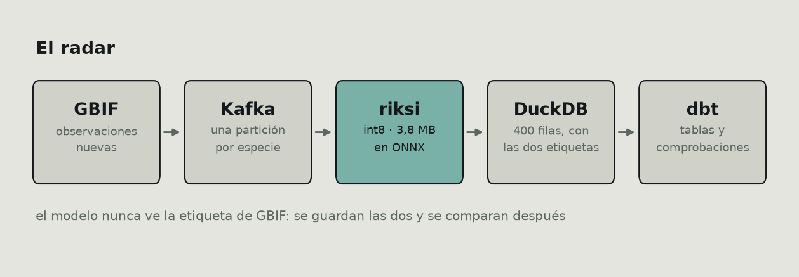
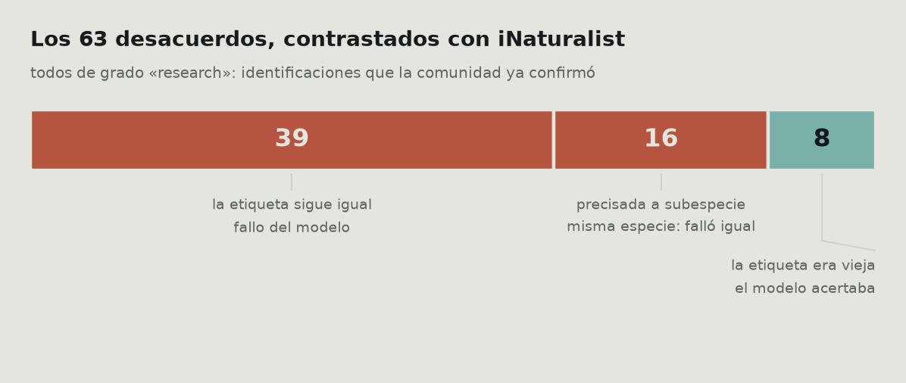
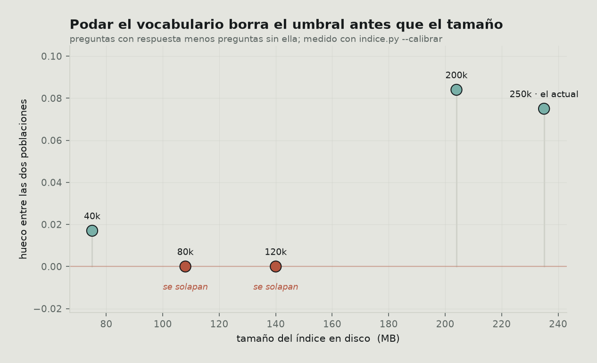

Entrené un clasificador de 100 especies de fauna ecuatoriana, monté un pipeline
para verlo trabajar sobre observaciones reales, y le puse un agente encima. Tres
repositorios, unos tres meses.

Este post no va de cómo los construí. Va de que **cada vez que medí algo en
serio, el número bajó** — y de que ese es el trabajo, no un contratiempo.

Van cuatro casos. En los cuatro la primera cifra era defendible, estaba publicada
y era engañosa.

---

## El montaje

Lo justo para que se entienda el resto:

| | |
|---|---|
| **[riksi](https://github.com/DiegoFernandoLojanTenesaca/riski)** | EfficientNet-Lite0, 100 especies, 3,8 MB en int8. Corre en el navegador con ONNX Runtime Web |
| **[riksi-radar](https://github.com/DiegoFernandoLojanTenesaca/riksi-radar)** | Kafka → el modelo → DuckDB → dbt. Trae observaciones nuevas de [GBIF](https://www.gbif.org/) y las clasifica sin ver la etiqueta |
| **[yachaq](https://github.com/DiegoFernandoLojanTenesaca/yachaq)** | Un agente sobre lo anterior: RAG, memoria, servidor MCP |



El modelo acierta **79,8 %** top-1 sobre 1000 imágenes de validación. Esa cifra
está bien medida y no es ninguna de las que van a caerse.

Lo que sí conviene decir de entrada es cómo llegó a 3,8 MB, porque es la única
decisión del proyecto que salió gratis:


Ese es el trato: **0,4 puntos de acierto por un modelo 3,5 veces más pequeño**.
En un clasificador que tiene que descargarse en el navegador de alguien con datos
móviles, no hay discusión.

---

## Caso 1 · «El modelo mejora fuera de su reparto»

Las imágenes de validación salen del mismo reparto que las de entrenamiento:
mismas fuentes, mismos fotógrafos, mismo sesgo de encuadre. Un 79,8 % ahí
responde a una pregunta bastante estrecha, y no es la que importa. La que importa
es qué pasa cuando llega una foto que nadie eligió.

Por eso monté el radar. La idea es simple: coger observaciones que se subieron a
GBIF **después** de entrenar, de gente distinta, y pasar cada foto por el modelo
sin dejarle ver la etiqueta. Después se comparan.

400 observaciones. **337 aciertos: 84,2 %.**

Seis puntos por encima del banco de validación. Lo escribí en el README con la
palabra «sube» en negrita.

Está mal. No la aritmética — el sesgo.


El panel izquierdo es el problema: **una sola especie, la iguana marina, es 128
de las 400 observaciones.** Las tres primeras juntas son la mitad del conjunto, y
de las 100 especies que el modelo conoce solo aparecen 20.

La ciencia ciudadana no muestrea uniformemente. La gente fotografía lo que ve, y
en Galápagos ve iguanas marinas. Ese 84,2 % es sobre todo la nota del modelo en
una especie, repetida 128 veces.

Y mirando el panel derecho se ve por qué eso infla el número y no lo hunde: la
iguana marina está entre las que **mejor** se le dan (94,5 %). El conjunto está
dominado por un caso fácil.

Promediando por especie en vez de por observación —dando el mismo peso a la
iguana que a la tortuga que sale tres veces:

| | acierto |
|---|---|
| por observación | 84,2 % |
| **promediando especies** | **78,7 %** |

Son dos líneas de SQL de diferencia:

```sql
-- por observación: cada foto pesa lo mismo
select avg(coincide::int) from observaciones;

-- por especie: cada especie pesa lo mismo
select avg(tasa) from (
  select especie, avg(coincide::int) tasa
  from observaciones group by especie
);
```

Y ahí está lo interesante: **78,7 % en campo contra 78,0 % en el banco.** El
modelo no mejora fuera de su reparto. Se comporta igual.

Que es una conclusión más aburrida y mucho más creíble. «No hay deriva» es un
resultado; «mejora en producción» era un artefacto de cómo promedié.

> Si vas a publicar una sola cifra sobre datos de ciencia ciudadana, promedia por
> clase. La media por observación mide la distribución de tus datos tanto como tu
> modelo.

### Por qué el pipeline tiene Kafka

Una objeción razonable: 400 observaciones caben en un CSV. ¿Para qué Kafka?

Porque el número real no es 400. GBIF recibe unas **130.000 observaciones diarias
solo de Ecuador**, y de esas el 1,6 % cae en las cien especies que el modelo
conoce — unas 6.000 al día. Las 400 son un corte para medir, no el caudal.

Aun así, la lección de montarlo fue otra. **Kafka no arrancaba**, y el error
apuntaba a un sitio equivocado:

```
advertised.listeners cannot use the nonroutable meta-address 0.0.0.0
```

Yo ya había sobreescrito `advertised.listeners`. Me costó cuatro intentos ver que
la queja no era por ese, sino por el listener del **controlador**, que también
estaba en `0.0.0.0` y del que Kafka deriva su dirección anunciada:

```properties
# el que importa es el segundo, no el primero
listeners=PLAINTEXT://0.0.0.0:9092,CONTROLLER://localhost:9093
advertised.listeners=PLAINTEXT://localhost:9092
```

Y una segunda, más silenciosa: **Kafka daba al consumidor por muerto.** Por
defecto entrega 500 registros por `poll()` y espera el siguiente en cinco
minutos. Descargar y clasificar 500 fotos lleva mucho más, así que Kafka
reasignaba las particiones y el `commit` fallaba con *«the group has already
rebalanced»* — perdiendo el trabajo ya hecho.

```python
consumidor = KafkaConsumer(
    TEMA,
    max_poll_records=20,        # lotes que sí caben en el intervalo
    max_poll_interval_ms=900_000,
    enable_auto_commit=False,   # se confirma al terminar el lote, no antes
)
```

El `enable_auto_commit=False` es lo importante: con confirmación automática,
Kafka marca como procesado lo que aún estás descargando, y si el proceso muere a
la mitad esas observaciones no vuelven nunca.

---

## Caso 2 · Los desacuerdos que no eran del modelo

Quedaban 63 observaciones donde el modelo y GBIF discrepaban. Tres explicaciones
posibles: falló el modelo, la observación está mal identificada, o la foto no
muestra lo que dice el registro.

Escribí en el README que el pipeline no decide cuál, y que las tortugas de
Galápagos que salían repetidas eran «taxonomía en disputa entre biólogos».

Me lo inventé. Sonaba plausible y no lo comprobé.

Resulta que hay una cuarta explicación, y es comprobable: **GBIF publica
instantáneas periódicas, no un espejo en vivo de iNaturalist.** Una observación
que iNaturalist ya corrigió puede seguir en GBIF con la identificación vieja.

Se verifica en dos saltos. GBIF guarda el identificador de iNaturalist en
`catalogNumber`, así que se puede preguntar cuál es la identificación **de hoy**:

```python
def _en_inaturalist(clave_gbif):
    oc = _pedir(f"{GBIF}/occurrence/{clave_gbif}")
    id_inat = oc.get("catalogNumber")          # el enlace a la fuente
    d = _pedir(f"{INAT}/observations/{id_inat}")
    o = d["results"][0]
    return {"taxon_hoy": (o.get("taxon") or {}).get("name"),
            "grado": o.get("quality_grade"),
            "identificaciones": o.get("identifications_count", 0)}
```

(El parámetro `photo_id` de la API de iNaturalist parecía el camino corto. No
filtra: devuelve los 382 millones de resultados y ya. Se ignora en silencio.)

Los 63, dos minutos de peticiones. 24 tienen hoy otra etiqueta.

Pero ahí hay una trampa que casi me como. No todos los cambios significan lo
mismo:

| cambio | qué es |
|---|---|
| `Anous stolidus` → `Anous stolidus galapagensis` | **refinamiento**: se precisó la población, la especie es la misma, el modelo falló igual |
| `Chelonoidis porteri` → `Chelonoidis niger porteri` | **otra especie**: pasó a colgar de *C. niger* |

En el segundo caso el modelo había dicho `Chelonoidis niger`. Bajo la taxonomía
de hoy, **acertó**. La tortuga de Santa Cruz pasó a ser subespecie de *C. niger*
y GBIF aún tenía la versión anterior.

Contarlos por separado es toda la diferencia entre un hallazgo y un autoengaño,
así que la lógica que juzga es lo único con test de verdad:

```python
def _juzgar(caso, hoy):
    gbif, dice, ahora = caso["gbif"], caso["modelo"], hoy["taxon_hoy"]
    if ahora == gbif:                           return "sigue igual"
    if _es_hijo(ahora, gbif):                   return "precisada"
    if ahora == dice or _es_hijo(ahora, dice):  return "el modelo tenía razón"
    return "cambió de especie"
```

`_es_hijo` compara por palabras y no con `startswith`, que daría por buena una
coincidencia a media palabra:

```python
def _es_hijo(taxon, especie):
    partes, base = (taxon or "").split(), (especie or "").split()
    return len(partes) > len(base) and partes[:len(base)] == base

assert not _es_hijo("Anous stolidusa", "Anous stolidus")
assert not _es_hijo("Anous stolidus", "Anous stolidus")   # ni hija de sí misma
assert     _es_hijo("Chelonoidis niger porteri", "Chelonoidis niger")
```

El resultado:



Ocho de 63 no eran fallos. Y los 63 son de grado *research* en iNaturalist —
identificaciones que la comunidad ya confirmó—, así que los otros 55 no tienen
dónde escudarse.

**Y aun así hay que rebajarlo.** Las ocho son del mismo taxón. Descontarlas sube
la media por especie de 78,7 % a 81,2 %, pero eso arregla una especie de veinte y
ninguna otra: es el sesgo del caso 1 entrando por otra puerta. La cifra que
seguiría publicando es 78,7 %.

Lo que sí deja es un dato reutilizable: **GBIF tenía desactualizado el 13 % de
los registros que miré.** Cualquiera que entrene con datos de GBIF sin
contrastarlos está heredando ese desfase.

---

## Caso 3 · El umbral que había puesto a ojo

El agente tiene un RAG sobre las fichas de las 100 especies. La pregunta de
siempre: ¿a partir de qué similitud una ficha recuperada es relevante?

Puse 0,5. Número redondo, sin ninguna razón.

Lo que hay que medir no es la similitud media, sino **si las dos poblaciones se
separan**: las preguntas que el corpus puede responder contra las que no. Si sus
distribuciones se solapan, no hay umbral bueno — el problema no es el número, es
que el índice no distingue.

```python
def mejor(p):
    fragmentos, vectores = _cargar()
    return float((vectores @ vectorizar([p])[0]).max())

buenas = sorted(mejor(p) for p in con_respuesta)                 # peor primero
malas = sorted((mejor(p) for p in sin_respuesta), reverse=True)  # mejor primero
corte = round((buenas[0] + malas[0]) / 2, 2)

if buenas[0] <= malas[0]:
    print("SE SOLAPAN: ningún corte las separa.")
```

Lo que se compara es **la peor de las buenas contra la mejor de las malas**. Si
esa comparación se invierte, no existe ningún umbral que funcione y el problema
no es el número: es el índice.

Se separaban, con un hueco de 0,075. El punto medio cae en **0,44**, no en 0,5.

Las preguntas «sin respuesta» son deliberadamente ajenas —«¿cuándo se estrenó
Blade Runner?», «receta de arroz con leche»—: si el índice no las rechaza, no
rechaza nada.

El bonus vino de intentar recortar el índice, que ocupaba 235 MB de los cuales
192 eran la tabla de vocabulario: 250.000 tokens para unos 50 idiomas, de los que
este proyecto usa 8.403. Parecía dinero tirado.



Podando a 120.000 términos el índice adelgaza un 40 % y **el umbral deja de
existir**: ya no hay hueco que partir. Sin medir la separación, ese recorte
parece gratis — el sistema sigue respondiendo, solo que ya no sabe cuándo callar,
que es lo único que impide a un RAG inventarse cosas.

Los ids intermedios no eran relleno de otros idiomas: son las subpalabras que
sostienen el español. Cortarlas hunde las preguntas buenas más de lo que hunde
las malas.

---

## Caso 4 · 671 MB en un contenedor de 512

Este no es de medición, pero es el que más me enseñó.

El agente tenía que caber en un plan gratuito: 512 MB. Con `fastembed`, el
proceso se iba a **671 MB** solo por cargar el codificador. Fuera.


Reescribí la inferencia con ONNX Runtime a mano. Dos cosas la arreglaron. La
primera, guardar los pesos como *external data*, que hace que onnxruntime los
mapee desde disco en vez de copiarlos:

```python
onnx.save(modelo, str(LIGERO / "modelo.onnx"), save_as_external_data=True, ...)

opciones = ort.SessionOptions()
opciones.enable_cpu_mem_arena = False      # sin arena que crece y no vuelve
ort.InferenceSession(ruta, sess_options=opciones)
```

Eso bajó a 457 MB en reposo. Pero el pico respondiendo llegaba a **467**, y con
45 MB de margen un contenedor de 512 muere al primer pico. Por eso la segunda
barra sigue en rojo aunque esté por debajo de la línea: el número que decide no
es el de reposo.

La segunda: soltar la sesión al terminar cada tanda en vez de retenerla.

```python
def vectorizar(textos):
    with _candado:
        try:
            return _vectorizar(textos)
        finally:
            if SOLTAR:
                _sesion.cache_clear()
                gc.collect()
```

Recargarla cuesta 0,93 s, así que el pico existe solo mientras se responde.
**154 MB**, con 358 de margen. Ese segundo por pregunta compra el RAG encendido
en un servidor gratuito; antes había que apagarlo entero.

Y no es una aproximación: **el coseno entre los vectores de las dos rutas es
1,0** y la diferencia máxima componente a componente es 0,0. Es el mismo cálculo.

Dos trampas por el camino, ambas silenciosas:

- **El *mean pooling* va ponderado por la máscara de atención.** Si promedias
  incluyendo el relleno, los vectores salen desplazados. No falla nada: el RAG
  simplemente recupera algo peor y le echas la culpa al modelo.

  ```python
  # mal: el relleno cuenta como si fueran palabras
  v = salida.mean(axis=1)

  # bien: solo los tokens reales
  mascara = lote["attention_mask"].astype(np.float32)[:, :, None]
  v = (salida * mascara).sum(axis=1) / np.maximum(mascara.sum(axis=1), 1e-9)
  ```

- **`enable_padding()` sin argumentos rellena hasta 512 tokens.** Una inferencia
  que tarda 0,2 s pasa a tardar un minuto, y no hay ningún aviso. Hay que
  pasarle `direction="right", pad_id=1, pad_token="<pad>"`.

También probé cuantizar el codificador a int8, como el clasificador. **Reduce el
disco pero no la RAM**: 252 → 135 MB en disco, y 395 → 397 en memoria, porque
onnxruntime descomprime los pesos al cargarlos. Y el hueco del corte se
estrechaba de +0,101 a +0,085. Descartado.

---

## Lo que sí funcionó a la primera (poco)

Para no dar la impresión de que todo se cayó:

- **Cuantizar el clasificador a int8** cuesta 0,4 puntos y baja el modelo de 13,5
  a 3,8 MB. La mejor relación del proyecto.
- **Promediar la imagen con su espejo** da 0,2 puntos por duplicar el tiempo de
  respuesta. Medido, y **no implementado** — medir para descartar también cuenta.
- **LangGraph contra una orquestación a mano**: 95 sentencias contra 55, 31,0 s
  contra 18,4 s. Pero LangGraph reanuda desde el checkpoint en 0,0 s y la mía no.
  Con dos nodos no compensa; con quince y trabajo caro que no quieres repetir,
  sí. Me quedé con la mía y dejé la comparación en el repo.

Y una decisión de ingeniería que sí pagó: **el agente corre sobre proveedores
gratuitos en cascada** —Groq, Mistral, Cohere y tres más—, cada uno con su
límite. Cuando uno devuelve 429, la petición pasa al siguiente con el mismo
historial. El fallo obvio que cometí: los tres ayudantes empezaban por el mismo
proveedor y se atropellaban entre ellos. Arrancando cada uno en un punto distinto
de la cascada, 15 s → 7 s.

---

## Lo que me llevo

**Una cifra que sube es sospechosa.** Las cuatro veces que un número me gustó,
estaba midiendo mi conjunto de datos y no mi modelo.

**Promedia por clase.** En datos de ciencia ciudadana, la media por observación
es casi una descripción de qué animales son fotogénicos.

**Comprueba la anécdota que suena bien.** «Taxonomía en disputa entre biólogos»
sonaba a que yo sabía de qué hablaba. Eran dos peticiones HTTP averiguar que era
falso, y la verdad resultó más interesante.

**Distingue tipos de cambio antes de contarlos.** 24 etiquetas cambiadas parecían
24 fallos ajenos. Eran 8. Los otros 16 eran míos y se disfrazaban de iguales.

**Un umbral sin la separación medida es decoración.** Y si el sistema aguanta con
un umbral inútil, nadie va a enterarse.

**Mide el pico, no el reposo.** 457 MB cabían en 512 sobre el papel. En la
práctica el contenedor moría.

---

## Trabajo futuro

Lo honesto es decir dónde no llega:

- **400 observaciones y 20 especies** no bastan para las otras 80. El radar
  tendría que correr semanas para tener algo por especie, y hasta entonces
  cualquier cifra por especie de las que salen tres veces es anecdótica.
- **Un solo modelo, un solo país.** Nada de esto dice si el patrón se repite en
  otro conjunto o con otra arquitectura.
- **La verificación contra iNaturalist es de un día.** Rehacerla dentro de seis
  meses diría cuál es el desfase típico de GBIF, que sería un dato de verdad útil
  para cualquiera que use esos datos para entrenar.
- **El sesgo se mide, no se corrige.** Saber que una especie es el 32 % no arregla
  que el modelo tenga poco con qué demostrarse en las otras 80.

Los tres repos están abiertos, y cada cifra de este post sale de un fichero que
está en ellos —hay un `--comprobar` en cada módulo que lo verifica:
[riksi](https://github.com/DiegoFernandoLojanTenesaca/riski) ·
[riksi-radar](https://github.com/DiegoFernandoLojanTenesaca/riksi-radar) ·
[yachaq](https://github.com/DiegoFernandoLojanTenesaca/yachaq)
